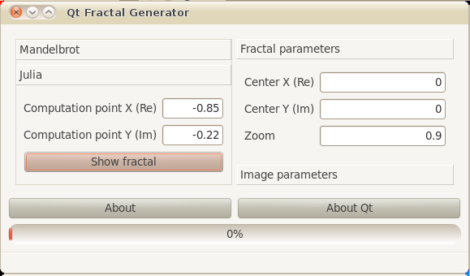
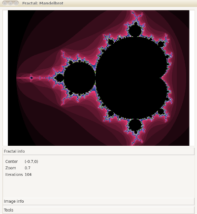
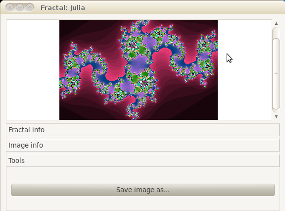

# Fractal image viewer
# Description

Qt cross-platform application that displays some fractals.
## Features

Supported fractals:
* Mandelbrot
* Julia fractal 

Supported color schemes:

* RGB color scheme
* RGB Band color scheme
* HSV color scheme 

## Screenshots
Main Window

Mandelbrot view

Julia view

